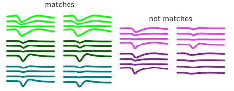

# nuron_waveform matching 

This is a repository for soft clustering of neuronal waveform comparisons into matches or not matches. 
I.e.: deciding if two putative units recorded via extracellular e-phys on separate occasions are in fact the same cell recorded twice.
The quantification of the difference between two waveforms is as in Tolias et al. 2007 (using d1 and d2 to quantify difference in shape and magnitude respectively).

Our method then uses a mixture of two gaussians model, with the parameters of one fixed to a 'null' and the second one is learnt using an Expectation-Maximization Algorithm.

We make use of NEO-core objects for neurophysiological data, as well as decorators so that functions are callable from the terminal. 
Scripts compatible with Python3.x



Figure showing examples of what matched and non-matched comparisons looked like in our dataset. 


# Reference:
```
Tolias, A. S.; Ecker, A. S.; Siapas, A. G.; Hoenselaar, A.; Keliris, G. A. & Logothetis, N. K.Recording chronically from the same neurons in awake, behaving primates.Journal of neurophysiology, 2007, 98, 3780-3790
```


